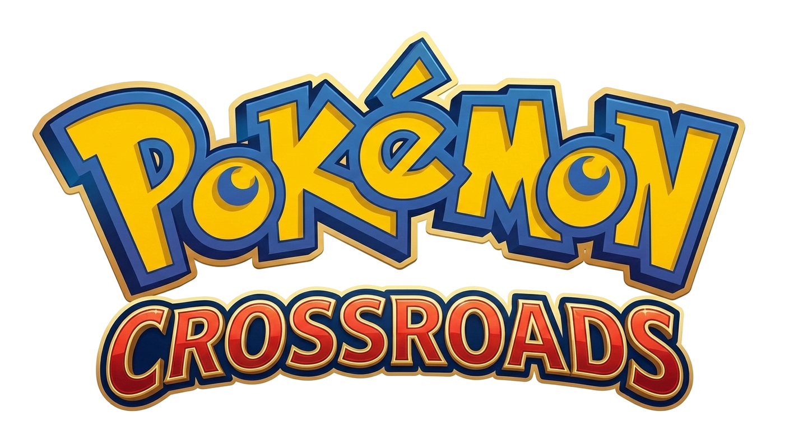
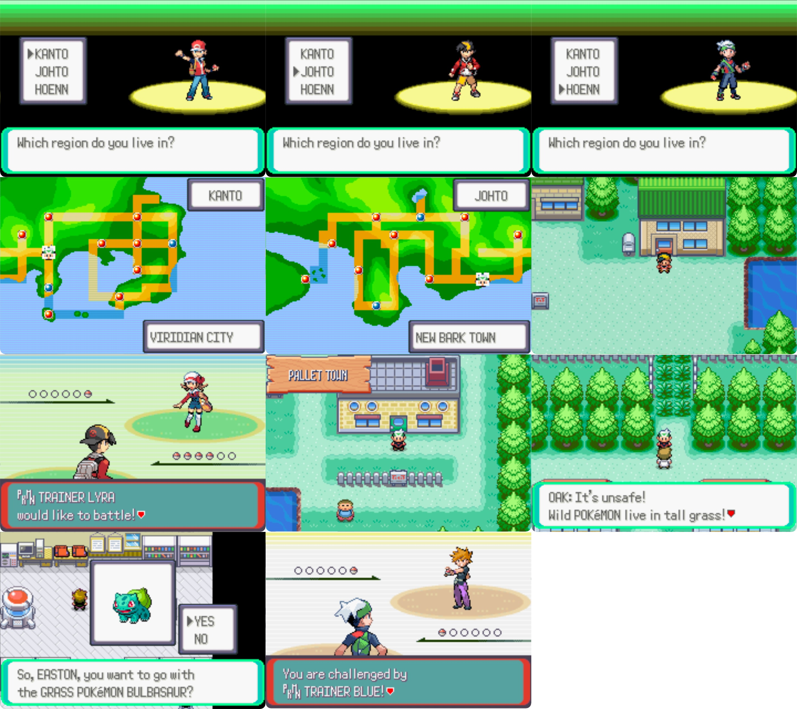

# Pokémon Crossroads

**Pokémon Crossroads** is a ROM hack of *Pokémon Emerald* developed by the **Crossroads Dev Team**.  
It combines the regions of **Hoenn**, **Kanto**, and (in development) **Johto** into one seamless, epic adventure — the kind of ultimate Game Boy Advance experience Game Freak might have created if they had merged these regions back in the day.

Discussion thread:  
https://www.pokecommunity.com/threads/pok%C3%A9mon-crossroads-kanto-johto-and-hoenn-joined.536507/

## New Discord Link!
You can join our Discord community with this link: https://discord.gg/ReWmTP86Ap

## Beta 1.4 – Now Available! (April 25, 2026)

The **Beta 1.4** release is live and ready to play.  
Download the .ups patch file from the [Releases section on GitHub](https://github.com/eonlynx/pokecrossroads/releases).

Main devs:
- eonlynx
- justgoose

Special thanks to:
- The pokeemerald-expansion team



### Key Features in Beta 1.4

- Three fully explorable regions: **Hoenn**, **Kanto**, and the **Sevii Islands**.
- Dual complete storylines: Play through the full stories of *Pokémon Emerald* and *Pokémon FireRed* — in any order you choose.
- **16 Gym Badges** total (8 from Hoenn + 8 from Kanto), with a major surprise planned for Beta 2.0.

### Known Issues

- **Trainer Card**: Kanto badges do not currently appear on your Trainer ID card.
- **Regional Travel**: Travel between Kanto and Hoenn via the Pokémon Centers in **Viridian City** or **Oldale Town**.
- **Save Compatibility**: Existing *Pokémon Emerald* save files are **not compatible** due to expanded memory allocation. Old saves are unlikely to ever work.
- Some specific items ported from *FireRed* are currently non-functional.

### What's Coming in Beta 2.0?

(Clue [here](https://www.pokecommunity.com/threads/pok%C3%A9mon-crossroads-kanto-johto-and-hoenn-joined.536507/) – keeping the mystery as in the original announcement)

## Story

What if Game Freak had built the ultimate Game Boy Advance Pokémon adventure?

**Pokémon Crossroads** lets you step into the shoes of a young trainer journeying across not just Hoenn, but also Kanto and (coming soon) Johto — all connected seamlessly into one grand storyline.  
Built on the powerful **pokeemerald-expansion** engine, we've integrated systems to bring these worlds to life authentically.

## How to Patch the ROM (Play the Beta)

You will need a legally obtained copy of **Pokémon Emerald (U)** (USA version, .gba file).

1. Go to: https://www.marcrobledo.com/RomPatcher.js/legacy/
2. Click "ROM file" and upload your **Pokemon - Emerald Version (U).gba**
3. Click "Patch file" and upload the **pokemon_crossroads_beta1.4.ups** file from our Releases
4. Wait for the green checkmark to appear
5. Click "Apply patch"
6. The patched ROM (**pokemon_crossroads_beta1.4.gba**) will download automatically

Play the resulting .gba file on your favorite GBA emulator.

## Recommended Emulators

- **PC / Mac / Linux**: [mGBA](https://mgba.io/) (highly recommended — best accuracy and debugging)
- **Android**: Pizza Boy GBA, Lemuroid, or RetroArch (with mGBA core)
- **iOS**: Delta, RetroArch (with mGBA core), or Ignited
- **Handhelds** (Steam Deck, Anbernic, etc.): RetroArch with mGBA core

## For Developers – How to Compile

This project is based on **pokeemerald-expansion** with custom multi-region features.

### Requirements
- devkitARM (version 65 or older recommended for compatibility)
- git, make, python3, and other standard build tools

### Steps
1. Clone the repository:
   ```bash
   git clone https://github.com/eonlynx/pokecrossroads.git
   cd pokecrossroads
   ```
2. (Optional but recommended) Initialize submodules if any are present:
   ```bash
   git submodule update --init --recursive
   ```
3. Build using the modern compiler:
   ```bash
   make modern
   ```
   - This produces `poke_crossroads.gba` in the project root.
   - Use `make clean` first if you want to rebuild from scratch.

For full setup details check [INSTALL.md](INSTALL.md).

**Note**: This project is not yet compatible with the latest Porymap versions. Use **Porymap 5** for mapping work.

## Current Progress

Development is moving steadily!

Completed core systems:

- ✅ Region switching: Seamless transitions between Hoenn, Kanto, and Johto with proper flag handling.
- ✅ Map integration: All major Kanto overworlds ported and functional with *FireRed* layouts and palettes.
- ✅ Multi-region minimaps: Each region displays its own map in the AreaNav with correct location names.
- ✅ Updated Fly system: Respects your current region and available landing points without cross-region bugs.

Current focus: Porting events, scripts, gym logic, dialogues, and cutscenes from Johto and Kanto into the Emerald engine.

**Actively looking for scripters and event designers** familiar with Gen III decompilation!

## Team & Help Wanted

Building a four-region adventure is a massive project.  
If you're a scripter, mapper, composer, or programmer, we'd love your help.

To contribute:
- Fork / join the repository: [https://github.com/eonlynx/pokecrossroads](https://github.com/eonlynx/pokecrossroads)
- Join the discussion: [PokeCommunity Thread](https://www.pokecommunity.com/threads/pok%C3%A9mon-crossroads-kanto-johto-and-hoenn-joined.536507/)
- Join the community: [Discord Server](https://discord.gg/ReWmTP86Ap)

## Credits

- **Game Base**: pokeemerald-expansion by rh-hideout.
- **Engine Logic**: cawtds for importing FireRed logic into Emerald.
- **Travel System**: AsparagusEduardo for fixing Kanto/Hoenn travel.
- **Sprites**: @h y o for Gold / Ethan sprites.
- **Community**: Special thanks to the decompilation and ROM hacking communities.

Full and continuously updated credits available on the [GitHub repository](https://github.com/eonlynx/pokecrossroads).

## Reporting Bugs

Please report all issues, glitches, or oddities on the [GitHub Issues page](https://github.com/eonlynx/pokecrossroads/issues).  
You can also post in the [PokeCommunity thread](https://www.pokecommunity.com/threads/pok%C3%A9mon-crossroads-kanto-johto-and-hoenn-joined.536507/).

Your feedback helps make the project better!

Thanks for playing **Pokémon Crossroads**!  
Enjoy the journey across the regions!
